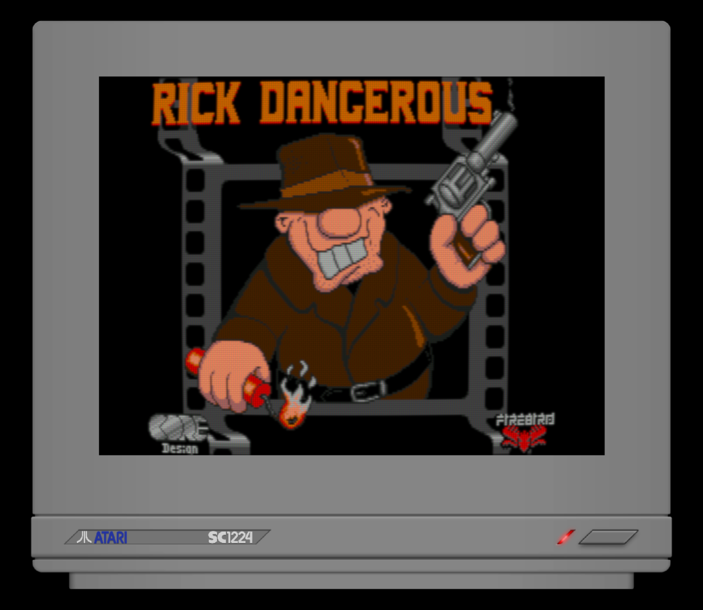
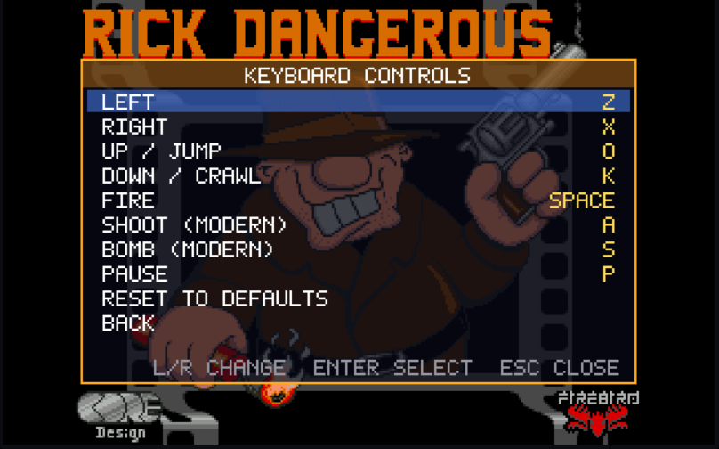

# xrick

**Rick Dangerous, on your Linux desktop.** A faithful, modernised build of the classic 1989 platformer
about an Indiana-Jones-style adventurer dodging rolling boulders, spikes and traps - with optional CRT
looks, monitor frames, a settings menu and gamepad support.

<p align="center">
  
</p>

## Highlights

- **Faithful to the original.** xrick is a from-scratch recreation of the PC and Atari ST versions,
  built by reverse-engineering the originals. It plays like the 1989 game.
- **One small file.** Everything - graphics, sound, levels, shaders - is inside a single ~1.5 MB
  executable. No data files to hunt down.
- **Retro looks, all optional.** Three CRT shaders, two upscalers, two monitor bezels and 4:3 pixel
  aspect correction. Or play it plain.
- **Settings menu.** Press <kbd>Esc</kbd> for a pausable menu with everything in one place, including
  full keyboard and gamepad remapping. Your choices are saved automatically.
- **Gamepad support.** Plug in a controller at any time.

## Getting started

1. Install **SDL3** and **libvorbis** from your distribution's package manager.
2. Download `xrick` from the [latest release](../../releases/latest).
3. Make it executable and run it:

```sh
chmod +x xrick
./xrick
```

To build it yourself, see [Building from source](#building-from-source).

## Controls

Rick has no separate shoot or bomb button in the original game - you hold **Action** and press a
direction. That's still the default, and it's part of the charm.

| | Keyboard | Gamepad |
|---|---|---|
| Move | Arrow keys (or <kbd>Z</kbd> <kbd>X</kbd> <kbd>O</kbd> <kbd>K</kbd>) | D-pad or left stick |
| Jump / climb up | <kbd>Up</kbd> | Cross (A) |
| Crouch / climb down | <kbd>Down</kbd> | D-pad down |
| Action | <kbd>Space</kbd> | Triangle (Y) |
| Pause | <kbd>P</kbd> | Start |
| Settings menu | <kbd>Esc</kbd> | Select |

**Classic controls (default):** hold **Action** and press **Up** to shoot, or **Down** to drop a bomb.

**Modern controls:** adds dedicated buttons so you don't have to juggle two keys - <kbd>A</kbd> shoots and
<kbd>S</kbd> drops a bomb on the keyboard, Circle (B) shoots and Square (X) drops a bomb on a gamepad. The classic
combo keeps working too. Switch in the settings menu or start with `-controls modern`.

Either way, **Rick has to be standing still** to shoot or drop a bomb - not running, not crouched. That's
how the 1989 game worked.

Gamepad button names above are PlayStation-style; the Xbox equivalents are shown in brackets. Every
binding can be changed in the settings menu.

## Settings menu

<p align="center">
  
</p>

Press <kbd>Esc</kbd> (or the gamepad's Select button) at any time. The game pauses and a translucent menu
appears over it. Press the same button again to close it.

- **Video** - fullscreen, window scale, aspect ratio, upscaler, CRT shader, bezel.
- **Audio** - volume and mute.
- **Game** - control scheme, game speed and the classic cheats.
- **Keyboard controls** and **Gamepad controls** - pick an action, press <kbd>Enter</kbd> (or Cross), then press
  the key or button you want. Bindings that clash with each other show in red.
- **Quit game** - asks for confirmation first.

Changes apply immediately and are saved to `~/.local/share/xrick/xrick/settings.ini`, then loaded next
time you start. Command-line options override the saved settings for that run.

## Video options

Everything here is optional and can be mixed freely.

| Setting | Choices |
|---|---|
| **Upscaler** | **None** - plain scaling. **Sharp** - crisp, clean pixels. **FSR1** - AMD's smoothing upscaler (softer). |
| **CRT shader** | **None**. **Easymode** - light and fast, scanlines and phosphor mask. **Lottes** - a glowing arcade-monitor look. **Royale** - the heaviest and most detailed. |
| **Bezel** | **None**. **Atari SC1224** - the Atari ST's own monitor. **Commodore 1084S** - the classic Amiga monitor. Bezels add a touch of screen curvature. |
| **Aspect ratio** | **4:3** (default) - matches the tall pixels of the original monitors. **Square** - shows 320x200 as-is. |

Lottes and Royale do their own scaling, so the upscaler setting doesn't apply while they're active.

Shortcuts: <kbd>F1</kbd> fullscreen, <kbd>F2</kbd>/<kbd>F3</kbd> window scale, <kbd>F4</kbd> mute, <kbd>F5</kbd>/<kbd>F6</kbd> volume,
<kbd>F7</kbd>-<kbd>F9</kbd> cheats, <kbd>F10</kbd> upscaler, <kbd>F11</kbd> CRT shader, <kbd>F12</kbd> bezel.

## Command-line options

Everything above can also be set at startup:

| Option | Meaning |
|---|---|
| `-fullscreen` | Start in fullscreen |
| `-zoom <n>` | Window scale factor (1-4) |
| `-upscale <none\|sharp\|fsr1>` | Upscaler |
| `-crt <none\|easymode\|lottes\|royale>` | CRT shader |
| `-bezel <none\|sc1224\|1084s>` | Monitor bezel |
| `-aspect <4:3\|square>` | Pixel aspect ratio |
| `-controls <classic\|modern>` | Control scheme |
| `-vol <n>` / `-nosound` | Volume / no sound |
| `-speed <n>` | Game speed |
| `-keys <left>-<right>-<up>-<down>-<action>` | Override the keyboard keys |
| `-help` | Show all options |

## Building from source

xrick is Linux-only.

You'll need a C compiler with C23 `#embed` support (GCC 15+ or a recent Clang), `make`, `pkg-config`,
`zip`, `glslc` (from shaderc or the Vulkan SDK), and the development files for SDL3, libvorbis and zlib.

```sh
make            # builds build/xrick
make release    # clean rebuild, stripped - what the release binary is built with
```

## About this project

**xrick** is a clone of Rick Dangerous made by carefully reverse-engineering the PC and Atari versions of the
game and re-coding it in C, by [bigorno](https://github.com/zpqrtbnk/xrick) (Stéphane Gay). You can read about
the original game from its creator, [Simon Phipps](https://www.simonphipps.com/games/rickdangerous/), and
about xrick on the original [xrick page](http://www.bigorno.net/xrick).

This fork starts from the "May 2005" (#050500) source and:

- ports it from SDL2 to **SDL3** with a custom `SDL_GPU` renderer for the shaders and bezels,
- embeds all data in the executable and converts the audio from WAV to Ogg Vorbis,
- adds the settings menu, gamepad support and modern control scheme,
- fixes a number of long-standing bugs, and
- removes the old Emscripten and Windows build code, to focus on a clean native Linux build.

## Credits

Beyond bigorno's original xrick, this fork builds on the work of others:

- **crt-royale** shader by [TroggleMonkey](https://github.com/libretro/slang-shaders/blob/master/crt/shaders/crt-royale/README.TXT) (GPL), via [libretro/slang-shaders](https://github.com/libretro/slang-shaders)
- **crt-easymode** shader by EasyMode (GPL), via libretro/slang-shaders
- **crt-lottes** shader by Timothy Lottes and the **sharp-bilinear** upscaler by Themaister (both public domain), via libretro/slang-shaders
- **FSR1** (FidelityFX Super Resolution 1.0) by AMD (MIT), via the RetroArch/libretro slang port (Unlicense)
- **Commodore 1084S** and **Atari SC1224** bezel images by [Duimon](https://github.com/Duimon/Duimon-Mega-Bezel) (CC BY-NC-ND 4.0), used unmodified
- **stb_image.h** by [Sean Barrett](https://github.com/nothings/stb) (public domain)
- **unzip.c** (minizip) by Gilles Vollant (zlib-style license)
